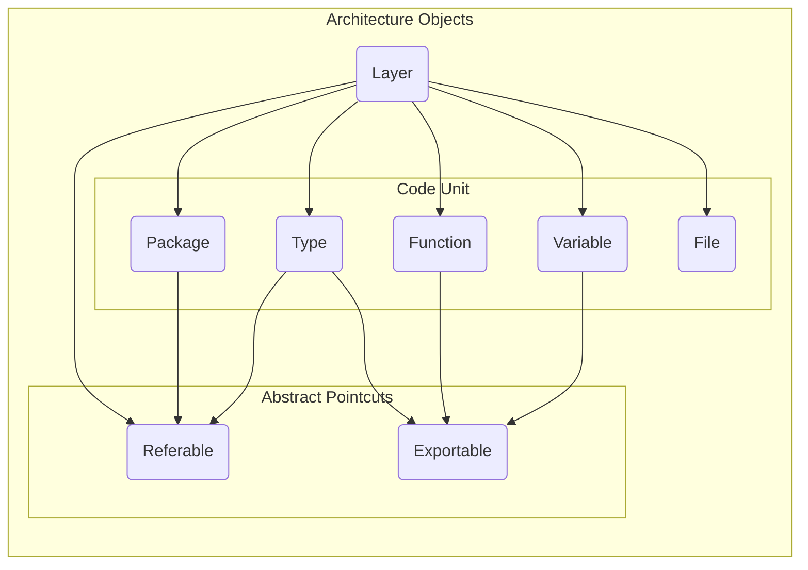

# ArchUnit for Go

`archunit` is a powerful and flexible library for enforcing architectural rules in your Go projects. It helps you maintain a clean and robust architecture by providing a fluent and declarative API for defining and validating architectural constraints. With `archunit`, you can ensure your code adheres to your intended design, preventing unwanted dependencies and maintaining modularity.

## Key Features

*   **Declarative, Fluent API:** `archunit` provides a fluent and declarative API that allows you to define architectural rules in a clear, readable, and chainable way. This makes your architecture tests easy to understand and maintain.

*   **Functional Approach:** The library promotes a functional style by treating rules as first-class citizens. You can define, combine, and pass rules as functions, leading to more modular and reusable architecture tests.

*   **Generic Support:** `archunit` leverages Go generics to provide type-safe and reusable selections and rules. This reduces boilerplate code, improves type safety, and makes your architecture tests more robust.

*   **Rich Pre-defined Rules:** Get started quickly with a comprehensive set of pre-defined rules for common Go best practices. These rules cover a wide range of checks, from naming conventions and package structure to dependency management and API design.

*   **Code as Promotion: AI-Guided Development:** `archunit` introduces a "Code as Promotion" paradigm, where your architectural rules act as a direct guide for AI code generation.
    *   **AI-Friendly Code Style:** The declarative and readable rules serve as a machine-readable design specification. This guides AI tools to generate code that is always aligned with your intended architecture.
    *   **Native AI Feedback Loop:** When a rule is violated, the assertion output is structured as a clear and actionable prompt. This "promotion" can be fed directly back to the AI, enabling it to learn from its mistakes and automatically correct the code, creating a powerful and efficient development feedback loop.

## Installation

To install `archunit`, use `go get`:

```sh
go get github.com/kcmvp/archunit
```

## Getting Started

`archunit` makes it easy to get started. Here's a simple example of how to check for common Go best practices and enforce a basic layering rule.

Create a test file (e.g., `architecture_test.go`) in your project's root directory:

```go
package main_test

import (
	"testing"

	"github.com/kcmvp/archunit"
)

func TestArchitecture(t *testing.T) {
    // Define your architectural layers
	domainLayer := archunit.ArchLayer("Domain", "github.com/your-project/domain/...")
	appLayer := archunit.ArchLayer("Application", "github.com/your-project/application/...")

    // Initialize ArchUnit with your layers
	arch := archunit.ArchUnit(domainLayer, appLayer)

    // Define and validate your rules
	err := arch.Validate(
        // Use a pre-defined set of best practice rules
		archunit.BestPractices(3, "config"),

        // Define a custom rule: the domain layer should not depend on the application layer
		archunit.Layers("Domain").ShouldNotRefer(archunit.Layers("Application")),
	)

	if err != nil {
		t.Fatal(err)
	}
}
```

## Core Concepts

`archunit` is built on a simple and powerful mental model. You define your architecture, select parts of it, and then apply rules to those selections. This can be broken down into three core concepts: **ArchObject**, **Selection**, and **Rule**.



### 1. ArchObject & Pointcuts: The Building Blocks

An **ArchObject** is the fundamental building block of your architecture. It represents a specific element within your codebase. `archunit` parses your code and models it into six concrete `ArchObject` types: **Layer**, **Package**, **Type**, **Function**, **Variable**, and **File**.

These objects are then categorized by **Pointcut Interfaces**, which define their architectural properties. For example:

*   `Referable`: Implemented by `Layer`, `Package`, and `Type`. This interface is a pointcut for applying dependency rules.
*   `Exportable`: Implemented by `Type`, `Function`, and `Variable`. This is a pointcut for applying visibility rules.

This design allows for a powerful, type-safe rule system. A rule that checks dependencies can only be applied to objects that are `Referable`.

### 2. Selection: Choosing What to Check

A **Selection** is the process of choosing which `ArchObjects` to apply a rule to. You start by selecting a broad category (e.g., `Packages(...)`) and then filter it using composable **Matchers** (e.g., `WithName(...)`, `Not(...)`). This allows you to create precise, composite selections that target specific parts of your architecture.

### 3. Rule: Defining the Constraints

A **Rule** defines the specific constraint you want to enforce on your selection. After selecting your objects, you chain a rule method to define the relationship. Because the selection is typed by the pointcut interfaces, only valid rules will be available. For example, you can only apply `ShouldNotRefer(...)` to a selection of `Referable` objects.

By combining Selections and Rules, you create a clear, declarative, and enforceable architectural test:

```go
// 1. Selection: All packages with the suffix "service"
//    (This selection is 'Referable')
// 2. Rule: Should not refer to any package in the "repository" layer.
Packages(HaveNameSuffix[Package]("service")).
    ShouldNotRefer(Layers("Repository"))
```

## Pre-defined Rules

`archunit` comes with a set of pre-defined rules for common Go best practices, available through the `BestPractices` function. These include checks for:

### Global Rules

These rules are applied to the entire project and are bundled together in the `BestPractices` function.

*   `AtMostOneInitFuncPerPackage`: Ensures that each package has at most one `init` function.
*   `ConfigurationFilesShouldBeInFolder`: Checks that all configuration files are in a specified folder.
*   `ConstantsAndVariablesShouldBeGrouped`: Enforces that `const` and `var` declarations are grouped.
*   `ConstantsShouldBeConsolidated`: Ensures all constants in a package are in a single file.
*   `ContextShouldBeFirstParam`: Checks that `context.Context` is the first parameter in functions.
*   `ContextKeysShouldBePrivateType`: Enforces that context keys are not built-in types.
*   `ErrorShouldBeLastReturn`: Ensures that `error` is the last return value in functions.
*   `NoPublicReAssignableVariables`: Prevents exported variables that can be reassigned.
*   `NoUnusedPublicDeclarations`: Checks for public declarations that are not used outside their package.
*   `PackageNamedAsFolder`: Enforces that a package's name matches its folder's name.
*   `PackagesShouldNotExceedDepth`: Checks that package depth does not exceed a maximum.
*   `TestDataShouldBeInTestDataFolder`: Ensures that test data is located in a `testdata` folder.
*   `VariablesShouldBeUsedInDefiningFile`: Checks that variables are used in the file where they are defined.
*   `VariablesAndConstantsShouldUseMixedCaps`: Enforces the `MixedCaps` naming convention.

### Architectural Object Specific Rules (Generic)

These rules are applied to specific selections of architectural objects.

#### Dependency Rules (for Layers, Packages, and Types)

*   `ShouldNotRefer`: Asserts that the selected objects do not refer to forbidden objects.
*   `ShouldOnlyRefer`: Asserts that the selected objects only refer to allowed objects.
*   `ShouldNotBeReferredBy`: Asserts that the selected objects are not referred to by forbidden objects.
*   `ShouldOnlyBeReferredBy`: Asserts that the selected objects are only referred to by allowed objects.

#### Visibility and Location Rules (for Types, Functions, and Variables)

*   `ShouldBeExported`: Asserts that the selected objects are exported.
*   `ShouldNotBeExported`: Asserts that the selected objects are not exported.
*   `ShouldResideInPackages`: Asserts that the selected objects reside in a package matching a given pattern.
*   `ShouldResideInLayers`: Asserts that the selected objects reside in one of the given layers.

#### Naming Rules (for all Architectural Objects)

*   `NameShould`: Asserts that the names of the selected objects match a given predicate.
*   `NameShouldNot`: Asserts that the names of the selected objects do not match a given predicate.

## Contributing

Contributions are welcome! Please feel free to submit a pull request or open an issue.

## License

`archunit` is licensed under the [MIT License](LICENSE).
